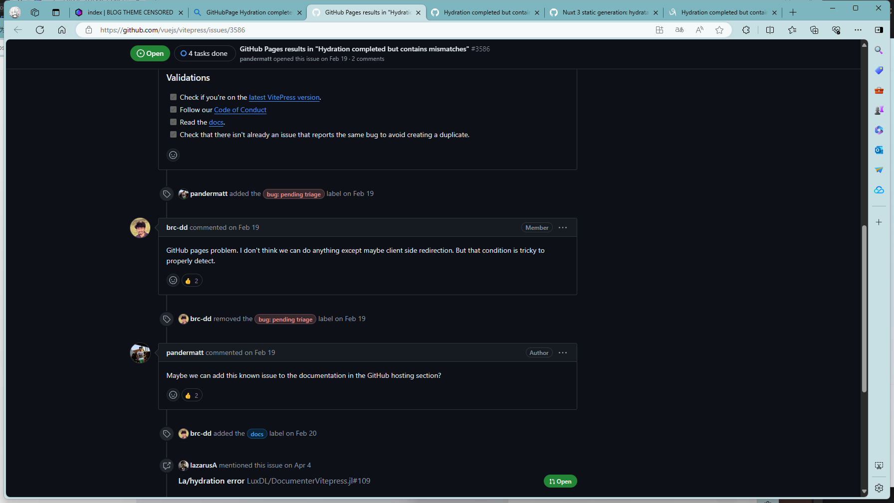

搭建该主题的本意是练习前端（博主才学了一两个月QAQ）。这个博客从2024/6/22开始搭建，在2024/7/14完成第一版的制作，目前完成的模块有：

- 主页HOME
- 关于ABOUT
- 友链FRIEND
- 归档ARCHIVES
- Tag
- 主题模式切换（虽然我基本用的夜间模式，白天模式没咋用心思设计）
- 基本的博客文章
- 博客封面
- 侧边栏
- 分页
- 导航栏
- 版权信息
- 文章封面
- 设备兼容（大概写了）

如你所见，目前只完成了一个博客该有的最基本功能的一小部分。后面可能应该大概会加的功能

- 节流防抖
- UI美化（现在毫无美观可言）
- 搜索
- 归档页根据时间范围归类
- 留言
- 评论
- 上下篇
- 打赏
- 各个模块的组件化，支持用户自定义（比如社交链接等）
- 发布主题（最终目标）
- 聊天室（可选）
- 等待发现

规范：

- git提交规范（husky）
- 代码规范
- ...

目前发现的bug

- 部署到GitHubPage时有些文章页面刷新后显示不完全 e.g. 主题测试，一刷新文章内容就消失了（没进行异步？）

  - 本地环境就没有这个问题

  - 有些文章也不会出现这种问题

  - 错误信息 `Hydration completed but contains mismatches`

    

    或许不是我的问题，后面换成vercel试试，然后发现也一样

    PS 怎么™莫名其妙又不会这样了，我真是草了（红温😡😡😡😡😡😡😡）

- 网站图标无法正常显示

- 本地的Archive文章时间是正确的，但是传到GithubPage就出问题了

- 等待发现

> 参考：
>
> vitepress官方默认主题
>
> [MaLuns/vitepress-theme-async](https://github.com/MaLuns/vitepress-theme-async)
>
> [ATQQ/sugar-blog](https://github.com/ATQQ/sugar-blog)
>
> [Volantis](https://volantis.js.org/)