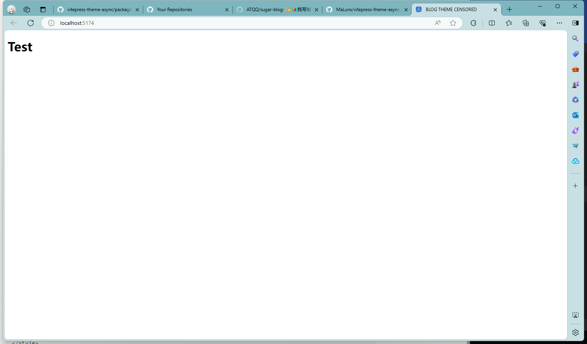
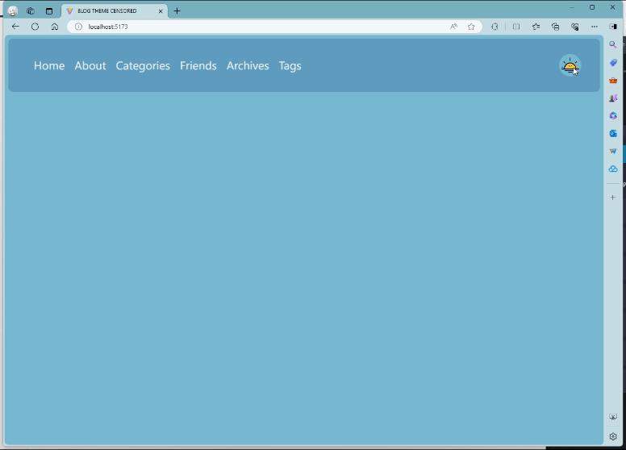
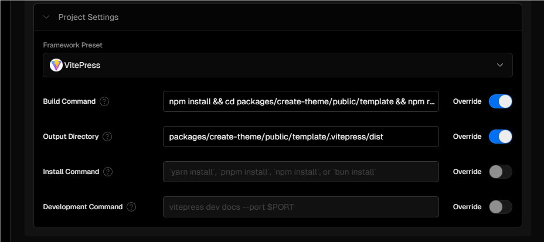

记录我在搭建这个博客主题遇到的问题以及学到的东西。这里写最基本的配置问题，包括vitepress的基础使用，以及ts配置文件的编写与使用。

<!--more-->

# Vitepress安装

> 参考：[VitePress 是什么？ | VitePress](https://vitepress.dev/zh/guide/what-is-vitepress)

我是在npm下安装的，其他同理。

安装：

```bash
 npm add -D vitepress
```

初始化项目：

```bash
npx vitepress init
```

然后根据提示初始化你的项目，如果需要自定义主题可以选择`Default Theme + Customization`或者`Custom Theme`

如果正在构建一个独立的 VitePress 站点，可以在当前目录 (`./`) 中搭建站点。但是，如果在现有项目中与其他源代码一起安装 VitePress，建议将站点搭建在嵌套目录 (例如 `./docs`) 中，以便它与项目的其余部分分开。

如果在当前目录搭建站点，则需要在`package.json`文件中修改：

```json
{
  ...
  "scripts": {
    "docs:dev": "vitepress dev", 			// vitepress dev docs 默认
    "docs:build": "vitepress build",
    "docs:preview": "vitepress preview"
  },
  ...
}
```

# 初始化主题项目

> 参考：
>
> - vitepress官方默认主题
> - [MaLuns/vitepress-theme-async](https://github.com/MaLuns/vitepress-theme-async)

`theme-default`默认主题的结构如下：

```
├─components		# 放组件的
│  └─icons
├─composables		# 放可复用的js/ts逻辑模块
├─fonts				# 字体文件
├─styles			# 放样式表的
│  └─components
└─support			# 放外部引用文件的
```

我们根据默认主题结构以及async主题的结构创建我们的主题项目（部分）：

```
├─docs
└─packages
    ├─create-theme				# 用于创建、打包主题
    │  ├─public
    │  │  ├─move				# 版本信息
    │  │  ├─posts				# 博客文章
    │  │  └─template			# 主题模板
    │  └─src					# nodejs安装脚本
    └─vitepress-theme-censored	# 主题主文件
        ├─assets				# 图片等资源
        ├─components			# 组件
        ├─composables			# 构造文件，主要是一些数据处理文件
        ├─config				# 主题配置文件
        ├─layouts
        ├─plugins				# 主题插件
        ├─styles
        ├─types					# 配置对象、主题配置、插件接口
        └─utils					# 工具函数等
```

使用`create-theme`的原因（个人看法）：

- 方便发布

- 方便进行主题配置

以我的主题为例，首先我们先进入`vitepress-theme-censored`中配置`package.json`，以便在`create-theme`中导入。

使用命令

```
npm init -y  # 跳过输入配置信息直接生成文件
```

在生成的`package.json`中写入你想要的配置信息，以下是我的配置：

```json
{
  "name": "vitepress-theme-censored",
  "version": "1.0.0",
  "repository": "git@github.com:Cainhappyfish/vitepress-theme-censored.git",
  "description": "",
  "author": "破酥 C4iN",
  "main": "index.ts",				// main: 包的主入口文件
  "type": "module",				 	// 包的类型，module 表示使用 ES 模块
  "types": "./types/index.d.ts",
  
  /* 	
	定义了包的导出配置，可以通过不同的路径导入包的不同部分
    . 表示包的根路径，导出 ./index.ts 作为默认导出，同时提供类型定义文件。
    ./config 表示可以通过 vitepress-theme-censored/config 导入 ./config/index.js 文件。
  */    
  "exports": {						
      ".": {
          "default": "./index.ts",
          "types": "./types/index.d.ts"
      },
      "./config": {
          "default": "./config/index.js"
      }
  },
  
  "scripts": {
    "test": "echo \"Error: no test specified\" && exit 1"
  },
  
  "keywords": [
    "vitepress-theme",
    "blog-theme"
  ],
  
  "license": "ISC"
}

```

> 配置文件`package.json`可以参考[nodejs官方文档](https://dev.nodejs.cn/learn/the-package-json-guide/)

然后进入create-theme中，安装

```
npm install <你的主题路径>
```

用`npm list`检查，成功：

```
+-- vitepress-theme-censored@1.0.0 -> .\packages\vitepress-theme-censored
```

> 这里不知道为什么config里面只用js不能用ts

## 项目基本配置

我们需要配置以下文件：

```
vitepress-theme-censored/index.ts 			# 该文件中的参数可以在 VitePress 主题和 Markdown 文件中被引用和调用
vitepress-theme-censored/types/index.d.ts	# TypeScript 声明文件
vitepress-theme-censored/types/theme.d.ts	# 主题接口配置
create-theme/config.mts						# 定义和配置站点的各种设置
```

`.d.ts`文件中定义 VitePress 的配置对象和主题配置对象的类型，以及如何导出一个定义配置的方法。这些声明可以帮助 TypeScript 理解 VitePress 的配置结构，并在开发过程中提供类型检查和代码补全。

- `index.ts`：站点配置

  [Using a Custom Theme | VitePress](https://vitepress.dev/guide/custom-theme)

- `index.d.ts & theme.d.ts`：定义 VitePress 中使用的各种类型，包括配置对象、主题配置、插件接口等

- `config.mts`： 文件用于定义和配置站点的各种设置，确保站点的基本信息、主题、插件和 Markdown 解析器的行为能够按照需求进行定制。

  [Site Config | VitePress](https://vitepress.dev/reference/site-config)

在`config/index.js`写入测试配置信息

```javascript
export const defaultConfig = {
  // some default configuration
};

export const defineConfig = (config) => {
// 这段代码的意思是创建一个新对象，该对象首先包含 defaultConfig 中的所有属性，然后包含 config 中的所有属性。如果 config 中的属性与 defaultConfig 中的属性重名，则 config 中的属性会覆盖 defaultConfig 中的同名属性。
  return {
    ...defaultConfig,
    ...config
  };
};
```

还有`packages/create-theme/public/template/.vitepress/config.mts`

```typescript
import { defineConfig } from 'vitepress-theme-censored/config';

export default defineConfig({
  title: "BLOG THEME CENSORED",
  description: "A theme for Vitepress"
})

```

以及`packages/vitepress-theme-censored/index.ts`：

```typescript
import Layout from './layouts/Layout.vue';

export default {
  Layout,
  enhanceApp({ app, router, siteData }) {
    // ...
  }
}
```

`packages/vitepress-theme-censored/layouts/Layout.vue`：

```vue
<script setup>

</script>

<template>
<h1> Test </h1>
</template>

<style scoped>

</style>
```

在`packages/create-theme/public/template`运行`npm run dev`，成功运行：



要在主题中动态传递内容参数，我们需要配置`types/index.d.ts`，`types/theme.d.ts`文件，并在`packages/create-theme/public/template/.vitepress/config.mts`写入我们想要的内容，这里我参考了`async`主题的配置：

`theme.d.ts`

```typescript
// 是否启用了 Algolia 搜索
declare const __ALGOLIA__: boolean
// 检查是否启用了本地搜索
declare const __VP_LOCAL_SEARCH__: boolean
// 键为字符串类型、值为任意类型的对象
declare type AnyObject = Record<string, any>

// 基本组件
declare namespace CensoredTheme {
    // 排序参数的类型，可以是字符串或一个键为字符串/数字、值为1或-1的对象
    type OrderByArg = string | Record<string | number, 1 | -1>;

    /** 文章基础信息 */
	interface PostData {}

	/** 导航栏链接 */
	interface NavItemWithLink {}
	
	// 带子菜单的nav
	interface NavItemWithChildren {}

	/** 友情链接 */
	interface Links {}

	/** 文章目录 */
	interface MenuItem {}

	/** 语言文件 */
	interface Language {}
}

declare namespace CensoredTheme {
	/**
	 * 网站图标配置 || Configure the icon information of the blog
	 */
	interface FaviconConfig {}

	/**
	 * 用户配置 || User config
	 */
	interface UserConfig {}

	/**
	 * 顶部导航栏 || Layout top bars
	 */
	type TobBarsConfig = Array<CensoredTheme.NavItemWithLink | CensoredTheme.NavItemWithChildren>;

	/**
	 * 横幅配置 || Layout banner config
	 */
	interface BannerConfig {}

	/**
	 * 侧栏配置 || Layout sidebar config
	 */
	interface SidebarConfig {}

	/**
	 * 页脚配置 || Layout footer config
	 */
	interface FooterConfig {}

	/**
	 * 关于页 || About page config
	 */
	interface AboutPageConfig {}

	/**
	 * 友情链接列表 || Links config
	 */
	type LinksConfig = Links[];

	/**
	 * 文章封面图 || Post cover image
	 */
	interface ConverConfig {}

	/**
	 * 页面分页配置 || [index | archives | categorys | tags] page sort paging config
	 */
	interface PaginationConfig {}

	/**
	 * 内置页面跳转地址 || built in page path config
	 */
	interface BuiltPageConfig {}

	/**
	 * 固定按钮显示配置 || Fixed button config on the right
	 */
	interface FixedBtnConfig {}

	/**
	 * 文章上下页 || the upper and lower pages of the article
	 */
	interface PostPaginationConfig {}

	/**
	 * 打赏配置 || Reward config
	 */
	interface RewardConfig {}

	/**
	 * 文章版权信息 || Creative commons config
	 */
	interface CreativeCommonsConfig {}
	/**
	 * 过期提取 || notice outdate
	 */
	interface NoticeOutdateConfig {}

}

declare module 'vitepress-theme-censored/config' {
	// 从 'vitepress-theme-censored' 模块导入 CensoredThemeConfig 类型
	import { CensoredThemeConfig } from 'vitepress-theme-censored';
	// 从 'vitepress' 模块导入 UserConfig 类型
	import { UserConfig } from 'vitepress';

	// 导出 defineConfig 函数，该函数接受一个配置对象并返回相同类型的配置对象
	export const defineConfig: (config: UserConfig<CensoredThemeConfig>) => UserConfig<CensoredThemeConfig>;
	export const defaultConfig: CensoredThemeConfig;
}

declare module '@localSearchIndex' {
	// 导出 data 常量，类型为一个对象，其中键为字符串，值为返回 Promise<{ default: string }> 的函数
	const data: Record<string, () => Promise<{ default: string }>>;
	export default data;
}

// 声明 DeepKeys 类型，用于获取对象的所有深层键
declare type DeepKeys<T> = T extends object
	? {
			[K in keyof T]-?: K extends string ? (T[K] extends object ? `${K}.${DeepKeys<T[K]>}` : `${K}`) : never;
	  }[keyof T]
	: never;

// 声明 DiffDateSuffix 类型，表示日期时间差的后缀
declare type DiffDateSuffix = {
	month: string;
	day: string;
	hour: string;
	min: string;
	just: string;
};
```

`index.d.ts`

```typescript
import { DefaultTheme } from 'vitepress';
export declare interface CensoredThemeConfig {
/** 页面切换动画 | page transition animations */
	pageLoading?: boolean;

	/** 主题切换动画 | theme transition animations */
	themeLoading?: boolean;

	/** 自定义文章样式 */
	customMdStyle?: boolean;

	/** 将主题组件注册到全局 | register the global component */
	globalComponents?: boolean | Array<string>;

	/** 作者 | author */
	author?: string;

	/** 搜索 | search */
	search?: { provider: 'local'; options?: DefaultTheme.LocalSearchOptions };

	/** 时区 | timeZone*/
	timeZone?: number;

	/** 文章目录 | post folder */
	postDir?: string;

	/** 内置页地址配置 | built in page path config */
	page?: CensoredTheme.BuiltPageConfig;

	/** 首页分页 | Index page generator */
	indexGenerator?: Omit<CensoredTheme.PaginationConfig, 'date_fmt'>;

	/** 归档页 | Archive generator */
	archiveGenerator?: CensoredTheme.PaginationConfig;

	/** 上下页 | Post pagination */
	postPagination?: CensoredTheme.PostPaginationConfig;

	/** 导航栏 | Layout top bars */
	navBars?: CensoredTheme.TobBarsConfig;

	/** 用户信息 | User info */
	user?: CensoredTheme.UserConfig;

	/** 站点图标 | Configure the icon information of the site */
	favicon?: CensoredTheme.FaviconConfig;

	/** 横幅 | Banner config */
	banner?: CensoredTheme.BannerConfig;

	/** 侧栏 | Sidebar config */
	sidebar?: CensoredTheme.SidebarConfig;

	/** 页脚 | Footer config */
	footer?: CensoredTheme.FooterConfig;

	/** 自定义封面 | Customize the cover image */
	cover?: CensoredTheme.ConverConfig;

	/** 固定按钮 | Fixed button */
	rightside?: CensoredTheme.FixedBtnConfig;

	/** 关于页 | About page Config */
	about?: CensoredTheme.AboutPageConfig;

	/** 友情链接 | Links */
	links?: CensoredTheme.LinksConfig;

	/** 打赏 | Reward */
	reward?: CensoredTheme.RewardConfig;

	/** 目录 | outline */
	outline?: DefaultTheme.Outline;
	outlineTitle?: string;

	/** 语言 | i18n */
	languages?: Record<string, CensoredTheme.Language>;
}

import Theme, { defineTheme } from '../index';

import './theme.d.ts';
export default Theme;
export { defineTheme };
```

配置完成后，在`config.mts`写入你的主题信息，然后就可以开始写组件了。以下是项目目前的样子：



`config.mts`的一些参数请看[Site Config | VitePress](https://vitepress.dev/reference/site-config)，也可以参考我的配置。

## 主题部署

比如我是在GitHub Page上配的，~~本来的博客因为刷机刷没了~~，不是在根目录下搭建。我们需要在`create-theme`的`config.mts`中加入

```
base: '/vitepress-theme-censored/',
```

由于非根目录部署的存在，我们需要在用到url的地方使用`withBase()`将配置的 [`base`](https://vitepress.dev/zh/reference/site-config#base) 追加到给定的 URL 路径。另请参阅 [Base URL](https://vitepress.dev/zh/guide/asset-handling#base-url)。

这是我的workflow内容，样例文件可以在[Vitepress的官方文档](https://vitepress.dev/zh/guide/deploy#platform-guides)找到：

```
name: Deploy VitePress site to Pages

on:
  # 在针对 `main` 分支的推送上运行。如果你
  # 使用 `master` 分支作为默认分支，请将其更改为 `master`
  push:
    branches: [main]

  # 允许你从 Actions 选项卡手动运行此工作流程
  workflow_dispatch:

# 设置 GITHUB_TOKEN 的权限，以允许部署到 GitHub Pages
permissions:
  contents: read
  pages: write
  id-token: write

# 只允许同时进行一次部署，跳过正在运行和最新队列之间的运行队列
# 但是，不要取消正在进行的运行，因为我们希望允许这些生产部署完成
concurrency:
  group: pages
  cancel-in-progress: false

jobs:
  # 构建工作
  build:
    runs-on: ubuntu-latest
    steps:
      - name: Checkout
        uses: actions/checkout@v4
        with:
          fetch-depth: 0 # 如果未启用 lastUpdated，则不需要
      # - uses: pnpm/action-setup@v3 # 如果使用 pnpm，请取消注释
      # - uses: oven-sh/setup-bun@v1 # 如果使用 Bun，请取消注释
      - name: Setup Node
        uses: actions/setup-node@v4
        with:
          node-version: 20
          cache: npm # 或 pnpm / yarn
      - name: Setup Pages
        uses: actions/configure-pages@v4
      - name: Install dependencies
        run: npm ci # 或 pnpm install / yarn install / bun install
      - name: Build with VitePress
        run: |
             cd packages/create-theme/public/template
             npm run build # 或 pnpm docs:build / yarn docs:build / bun run docs:build
      - name: Check file
        run: ls
      - name: Upload artifact
        uses: actions/upload-pages-artifact@v3
        with:
          path: packages/create-theme/public/template/.vitepress/dist
  

  # 部署工作
  deploy:
    environment:
      name: github-pages
      url: ${{ steps.deployment.outputs.page_url }}
    needs: build
    runs-on: ubuntu-latest
    name: Deploy
    steps:
      - name: Deploy to GitHub Pages
        id: deployment
        uses: actions/deploy-pages@v4

```

如果你使用vercel，建议在本地进行部署，连接GitHub部署容易出现`Permission Denied`类似的错误。下面是我的配置：



注意，相比之前的这里我们的网页是部署在根目录下的，需要把`config.mts`中的`base`属性改为`'/'`，否则你的网页会爆炸的（指找不到静态文件），如果你之前就是部署在根目录请忽略这段话。

~~byd我忘了这茬debug搞了一晚上，被自己气晕~~


