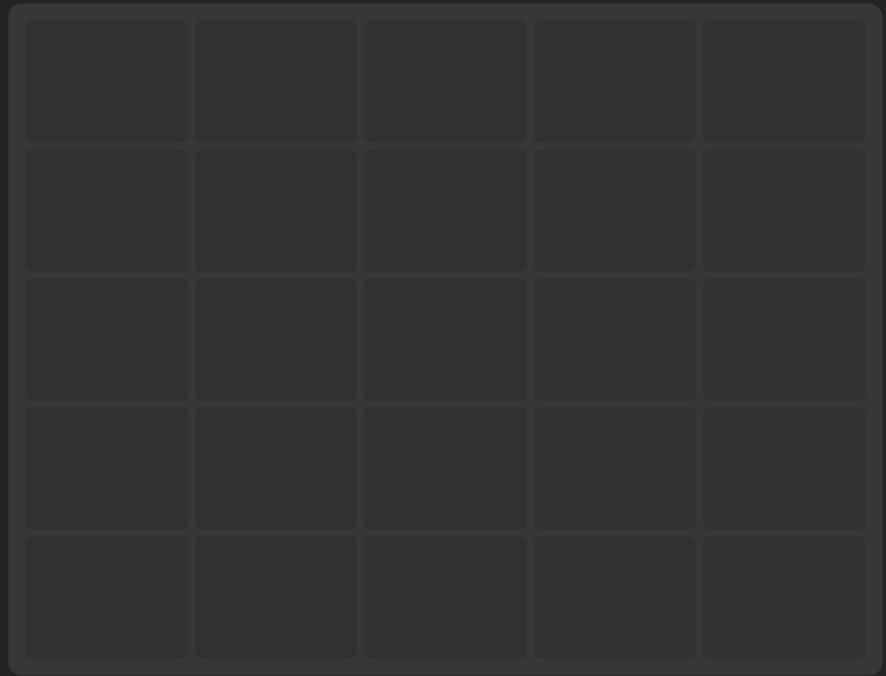
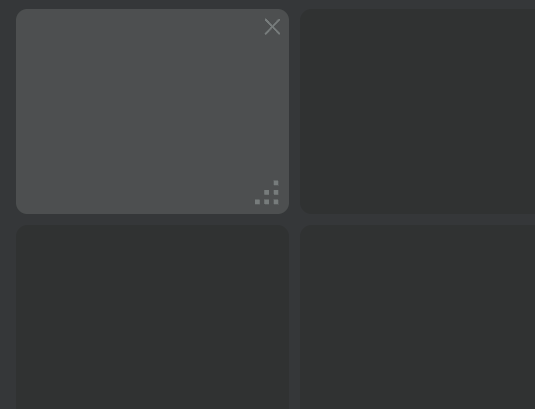
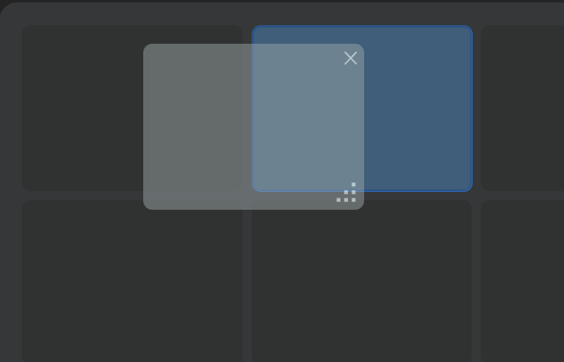
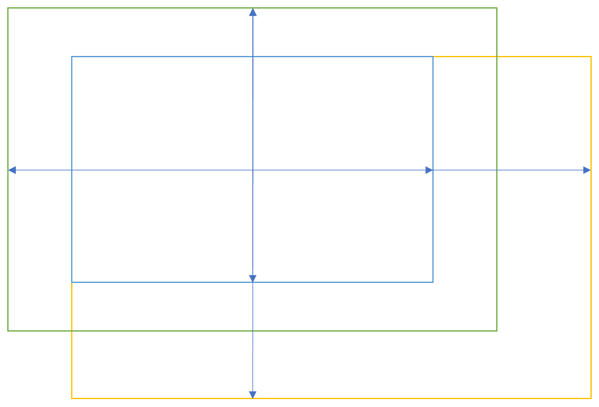
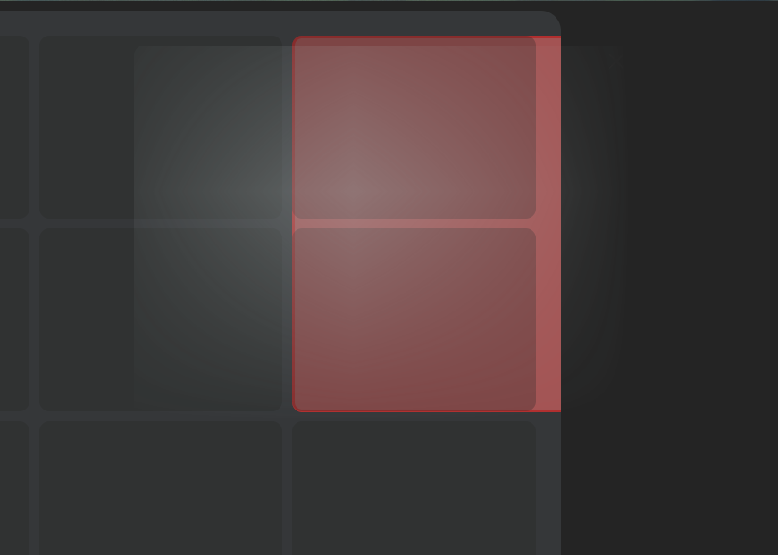
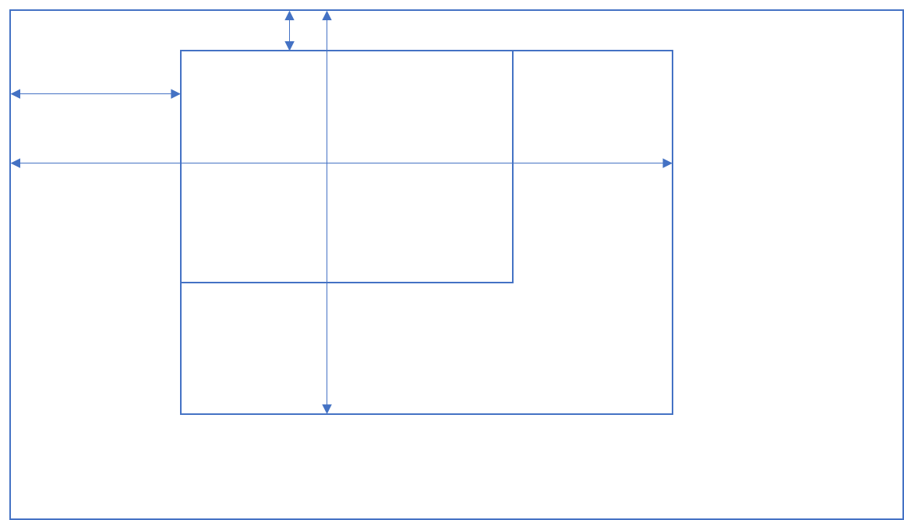
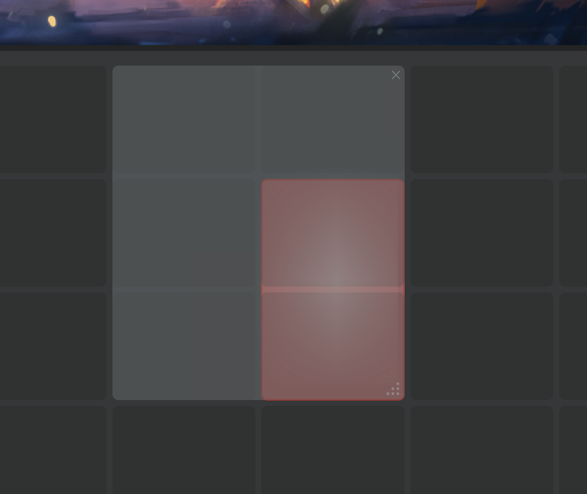
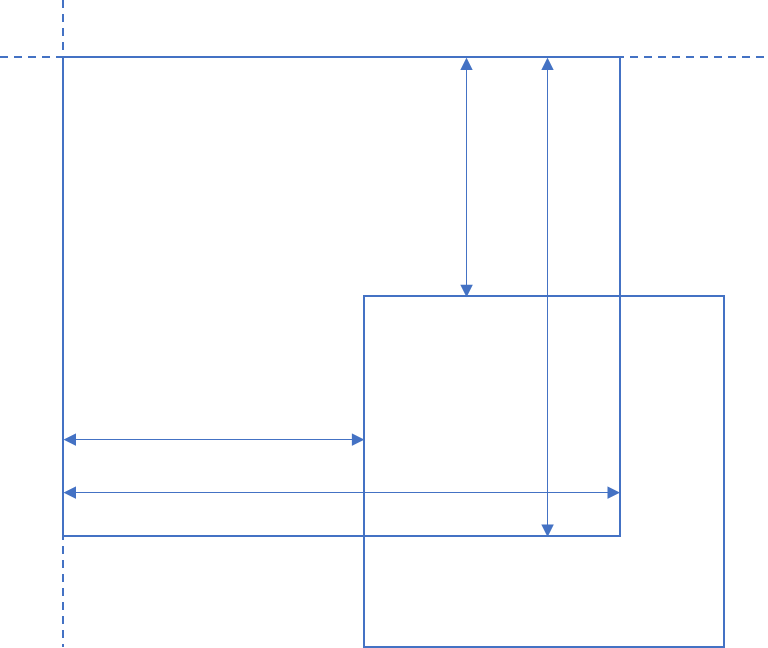
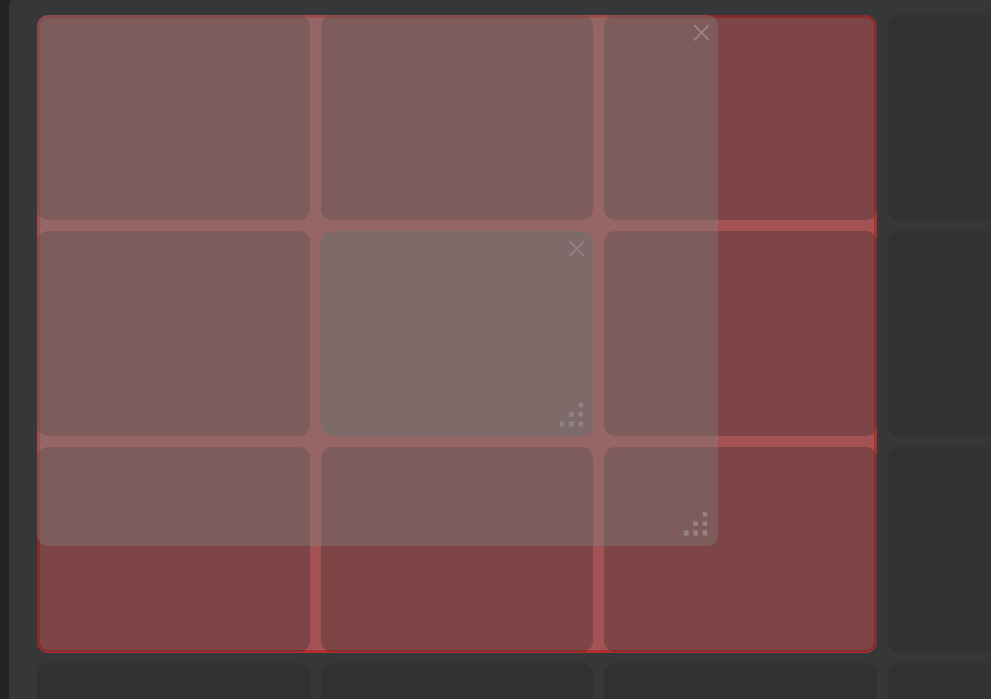
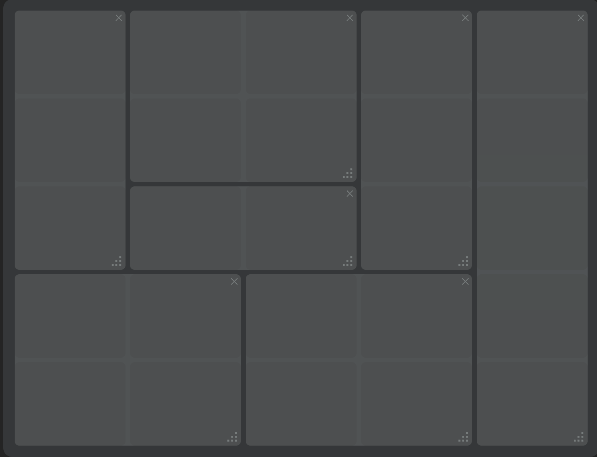

之前看大佬的博客（[白云苍狗的小站-手撸 Grid 拖拽布局](https://www.imalun.com/gird_layout/)）看到的，想着还挺有意思，试着学一下，写一个随想页面🥰

> 源码：[CainHappyfish/grid-drag (github.com)](https://github.com/CainHappyfish/grid-drag)

<!--more-->

# 拖曳API

拖拽中主要使用到的事件如下

- 被拖拽元素事件：

| 事件      | 触发时刻                                   |
| --------- | ------------------------------------------ |
| dragstart | 当用户开始拖拽一个元素或选中的文本时触发。 |
| drag      | 当拖拽元素或选中的文本时触发。             |
| dragend   | 当拖拽操作结束时触发                       |

- 放置容器事件：

| 事件      | 触发时刻                                         |
| --------- | ------------------------------------------------ |
| dragenter | 当拖拽元素或选中的文本到一个可释放目标时触发。   |
| dragleave | 当拖拽元素或选中的文本离开一个可释放目标时触发。 |
| dragover  | 当元素或选中的文本被拖到一个可释放目标上时触发。 |
| drop      | 当元素或选中的文本在可释放目标上被释放时触发。   |

让一个元素能够拖拽只需要给元素设置`draggable=”true”`即可拖拽，拖拽事件 API 提供了`DataTransfer`对象，可以用于设置拖拽数据信息，但是仅仅只能`drop`事件中获取到。因为我们需要在拖拽中就需要获取到拖拽信息，用来显示拖拽时样式，所以需要自己处理这些信息存储起来，以便读取。我们需要告诉浏览器当前区域是可以放置的，只需要在元素监听拖曳事件即可，然后通过`preventDefault`来阻止浏览器默认行为。可以在这三个事件中处理判断当前位置是否可以放置等等。

# 网格布局生成

首先来制作网格布局，这里我们没有使用CSS的`display: grid`~~（其实是忘了）~~

```vue
<div class="drag-board" id="board" :key="boardKey">
  <div class="drag-row" v-for="indexX in row" :key="indexX">
    <CapDragGridItem v-for="indexY in column" :key="indexY"
                 :row="row"
                 :column="column"
                 :canvasX="CanvasWidth"
                 :canvasY="CanvasHeight"
                 @dragover="onDragOver"
                 @drop="onDrop"
    />
  </div>
</div>
```

这里我们可以根据用户输入的行列信息来生成表格，在组件挂载时，获取整个网格画布的大小，并存入变量中：

```typescript
const handleSize = () => {
  const board = document.getElementById("board")
  if (board) {
    CanvasWidth.value = board.offsetWidth - 40
    CanvasHeight.value = board.offsetHeight - 40
    boardKey.value++ // 增加 key 值，触发重新挂载
  }
}

onMounted(() => {
  handleSize()
})
```

效果如下：



# 卡片制作 & 拖曳事件处理

我们根据画布信息来生成拖曳卡片，并处理拖曳事件。

```typescript
const props = defineProps<{
  row: number,
  column: number,
  canvasX: number,
  canvasY: number,
  isDroppable: boolean
}>()

const emit = defineEmits<{
  size: [width: number, height: number, figured: boolean];
  position: [left: string, top: string]
}>()
```

我们从父组件（也就是画布）获得行列信息和画布信息以及当前拖曳位置是否能够被放置，向父组件传递当前卡片的大小和位置。将卡片设置为`draggable="true"`，效果如下：



## 拖曳事件处理

接下来我们着重介绍拖曳事件的处理。

### `dragstart`

```typescript
const onDragStart = (event: DragEvent) => {
  const id = (event.target as HTMLElement).id
  if (event.dataTransfer) {

    event.dataTransfer.setData("dragging", id)
    // 需要延时，否则会出错
    setTimeout(() => {
      BackGroundOpacity.value = 0
      previewStyle.value = "translate(-99999px, -99999px)"
    })
    emit('size', FinWidth.value, FinHeight.value, true);
    emit('position', PositionX.value, PositionY.value)
  }
}
```

当鼠标点击可拖曳卡片时，就会触发`dragstart`事件。我们获取触发事件卡片的id，并存入`event.dataTransfer`中。`previewStyle.value = "translate(-99999px, -99999px)"`解决了卡片拖曳时`drop`位置被自身覆盖无法放置问题。这里延时设置卡片的透明度和位移是为了避免拖曳时鼠标处卡片预览消失以及拖曳失效。

### `dragend`

```typescript
const onDragEnd = () => {
  // console.log("drag end")
  BackGroundColor.value = ""
  BackGroundOpacity.value = 0.6
  BackGroundOpacity.value = 0.6
  Border.value = ""
  if (props.isDroppable) {
    DefaultPosition.value = ""
  }
  previewStyle.value = ""
  // console.log("drag end")
}
```

拖曳结束时（鼠标触发开），注意这里不一定会触发`drop`，因为结束位置的元素不一定可放置或者不会响应`drop`事件。这里恢复卡片拖曳前的样式。

### `dragover`

```typescript
const onDragOver = (event: DragEvent) => {
  event.preventDefault();
  const CardRight = computed(() => (PreviewData.value.Left + PreviewData.value.Width - 15))
  const CardBottom = computed(() => (PreviewData.value.Top + PreviewData.value.Height - 15))
  
  previewStore.isPreviewed = false
  isDroppable.value = !(CardRight.value > CanvasWidth.value || CardBottom.value > CanvasHeight.value);

  PreviewData.value.X = ( (event.target as HTMLElement).offsetLeft - 25 ) / ItemWidth.value
  PreviewData.value.Y = ( (event.target as HTMLElement).offsetTop - 25 ) / ItemHeight.value

  PreviewData.value.Left = (event.target as HTMLElement).offsetLeft
  PreviewData.value.Top = (event.target as HTMLElement).offsetTop

}
```

拖曳过程触发`dragover`事件。这里`event.preventDefault()`阻止默认事件允许当前拖曳元素被放置到监听元素。在拖曳过程中我们需要获取预览卡片信息，并根据该信息生成预览卡片，效果如下：



同时我们还需要判断目标位置是否能够被放置，判断方法很简单，只需要计算卡片右侧相对画布左侧的距离是否大于画布大小即可，注意要减掉margin。



最后效果如下



### `ondrop`

```typescript
const onDrop = (event: DragEvent) => {
  event.preventDefault()
  previewStore.isPreviewed = true

  if (event.dataTransfer) {
    const id = event.dataTransfer.getData("dragging")
    const GridItem = document.getElementById(id)
    if (GridItem && isDroppable.value) {
      (event.target as HTMLElement).appendChild(GridItem);
    } else {
      PreviewData.value.Left = parseInt(CardPosition.value.X)
      PreviewData.value.Top = parseInt(CardPosition.value.Y)
    }

  }

}
```

当拖曳结束且当前位置元素允许放置时，触发`drop`事件。我们从`data.Transfer`获取触发`dragstart`元素的id，将其添加到目标元素的子元素中。注意，如果当前位置不允许放置，则需要将预览位置设置为卡片拖曳前的位置。

## 卡片缩放

当我们点击右下角缩放图标时，触发卡片缩放。卡片缩放有两种方式：

- 通过`ResizeObserver API`监听，但是这个 API 还会监听到其他因数引起变动，比如窗口大小变动，导致元素变动等等。
- 使用监听鼠标事件，但是这个会存在与拖放事件同时触发问题。

这里我使用第二种方法实现缩放。

```typescript
const CurrentCard = (event.currentTarget as HTMLElement).parentElement
const mouseMoveHandler = (e: MouseEvent) => {
    if (CurrentCard) {
      ResizeWidth.value = e.pageX - CurrentCard.getBoundingClientRect().x;
      ResizeHeight.value = e.pageY - (CurrentCard.getBoundingClientRect().y + window.scrollY);
      // 这一大坨的if应该可以优化，但我懒
      // 长宽超过最大值
      if (ResizeWidth.value > props.canvasX) {
        FinWidth.value = props.canvasX - 10
      }
      else if (ResizeHeight.value > props.canvasY) {
        FinHeight.value = props.canvasY - 10
      }
      // 缩放时超出容器
      else if (CurrentCard.offsetLeft + ResizeWidth.value - 15> props.canvasX ||
          CurrentCard.offsetTop + ResizeHeight.value - 10> props.canvasY) {
          // 什么也不干
      }
      else {
        if (ResizeWidth.value > MinWidth) {
          resizeCol.value = Math.ceil(ResizeWidth.value / (ItemWidth.value + 10))
          CurrentCard.style.width = ResizeWidth.value + 'px';
          FinWidth.value = resizeCol.value * ItemWidth.value - 10
        } else {
          CurrentCard.style.width = MinWidth + 'px';
          FinWidth.value = MinWidth
        }

        if (ResizeHeight.value > MinHeight) {
          resizeRow.value = Math.ceil(ResizeHeight.value / (ItemHeight.value + 10))
          CurrentCard.style.height = ResizeHeight.value + 'px';
          FinHeight.value = resizeRow.value * ItemHeight.value - 10
        } else {
          CurrentCard.style.height = MinHeight + 'px';
          FinHeight.value = MinHeight;
        }

      }

      emit('size', FinWidth.value, FinHeight.value, true);
      previewStore.isPreviewed = false

    }
}
```

我们用当前鼠标相对画布的位置减去卡片左上角的位置来获取缩放后的卡片大小：



同样的，在缩放的同时我们也要检测是否超出画布，并使缩放后的大小不超过画布大小，也不小于网格大小。

```typescript
const mouseUpHandler = () => {
    document.removeEventListener('mousemove', mouseMoveHandler);
    document.removeEventListener('mouseup', mouseUpHandler);
    if (CurrentCard) {

      CurrentCard.style.width = FinWidth.value + 'px'
      CurrentCard.style.height = FinHeight.value + 'px'

    }
    emit('size', FinWidth.value, FinHeight.value, false);
    previewStore.isPreviewed = true

}
```

当松开鼠标时，将卡片大小设置为缩放后的大小，并将数据传给父组件。

# 多个卡片

现在我们基本实现了单个卡片的拖曳和缩放功能，接下来实现多个卡片对应的功能。

首先我们需要给每一个卡片一个对应的id，以便我们区分。我们创建`drag.ts`文件定义数据结构：

```typescript
export interface ItemData {
  id: string
  /**
   * 卡片位置
   * */
  position: {
    X: number,
    Y: number,
  }
  /**
   * 卡片大小
   * */
  size: {
    width: number,
    height: number,
  }
  /**
   * 卡片内容
   * */
  content: {
    title: string,
    text: string,
    /**
     * 链接信息
     * */
    url: string,
    /**
     * 图片url
     * */
    IMGurl: string
  }
}
```

定义`DragCards`对象：

```
class DragCards <T extends ItemData>  {
  cards = new Map<string, ItemData>();

  set(key: string, data: T): void {
    this.cards.set(key, data);
  }

  remove(key: string): void {
    this.cards.delete(key);
  }

  get(key: string): ItemData | undefined {
    return this.cards.get(key)
  }
}
```

然后使用`Map`来存数据：

```
export const dragCards = new DragCards<ItemData>()
```

使用`v-for`即可，效果如下：


## 卡片碰撞

### 拖曳碰撞

拖曳碰撞比较简单，只要判断鼠标位置元素是不是也是卡片就行了。

```typescript
isDroppable.value = !(CardRight.value > CanvasWidth.value ||
  CardBottom.value > CanvasHeight.value ||
  CurrentElement.classList.contains('item-container') // 判断碰撞
)
```

当然我这里其实有点不友好，拖曳放置的判断鼠标位置而不是根据预览卡片的位置来放置的。比起单个卡片，我们需要修改预览卡片的位置信息：

```typescript
 const board: HTMLElement | null = document.querySelector(".drag-board")
  if (board) {
    PreviewData.value.X = Math.floor((event.clientX - board.getBoundingClientRect().x - 25) / ItemWidth.value)
    PreviewData.value.Y = Math.floor((event.clientY - board.getBoundingClientRect().y - 25) / ItemHeight.value)
  }

  PreviewData.value.Left = PreviewData.value.X * (ItemWidth.value) + 25
  PreviewData.value.Top = PreviewData.value.Y * (ItemHeight.value) + 25
```

如果存在碰撞，我们这里触发事件的元素是碰撞卡片而不是网格，所以我们要用坐标来确定预览卡片的位置，最后效果如下：



### 缩放碰撞



由于我们是向右下方缩放的，所以只需要判断右下方的元素是否重叠即可。知道这回事就很简单了：如果卡片元素的右侧距离大于其他卡片某一元素的左侧且底部距离大于某一元素的顶部距离，则判断为碰撞。注意这里只有一个方向满足条件不会碰撞（~~我是StarBeat~~）。

```typescript
const cards = document.querySelectorAll('.item-container')
if (cards) {
cards.forEach((e) => {
      if (e.id !== CurrentCard.id) {
        resizable.value = !(( (CurrentCard.getBoundingClientRect().right >= e.getBoundingClientRect().left ) &&
             CurrentCard.getBoundingClientRect().bottom >= e.getBoundingClientRect().top
            ) &&
            (CurrentCard.getBoundingClientRect().left <= e.getBoundingClientRect().left &&
             CurrentCard.getBoundingClientRect().top <= e.getBoundingClientRect().top
            ))
      }
	})
}
```

最后效果如下：



# Grid拖曳布局最终效果

至此我们完成了Grid拖曳布局，效果如下：

